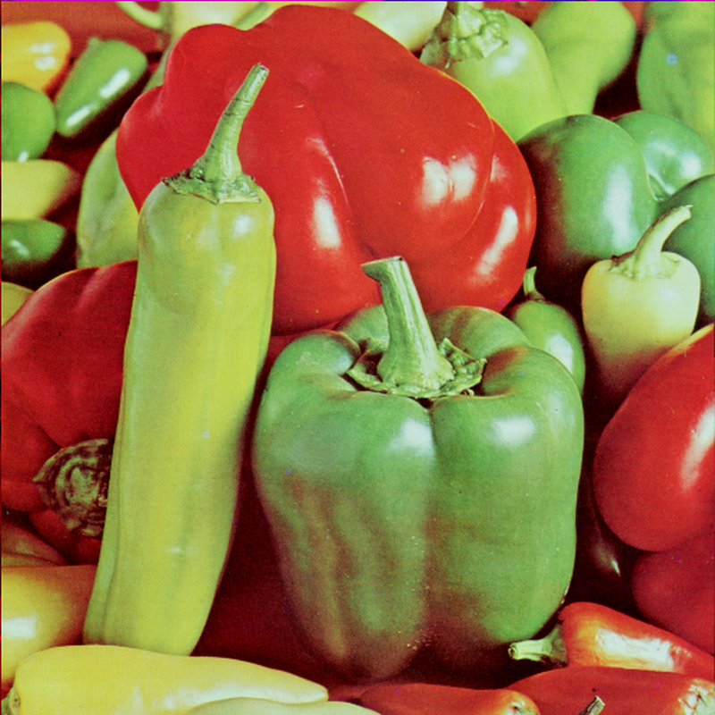
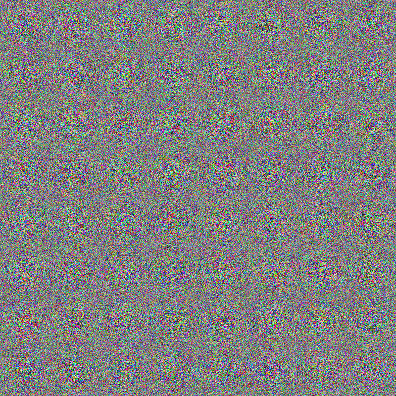
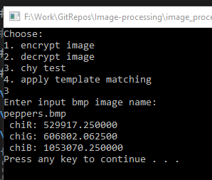
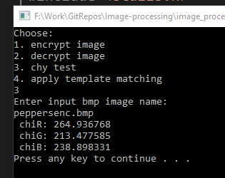
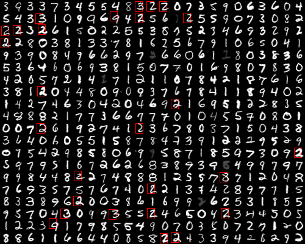
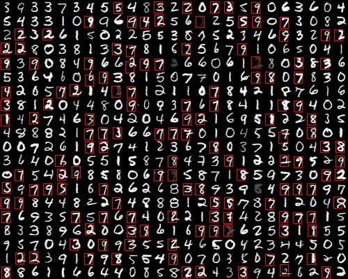
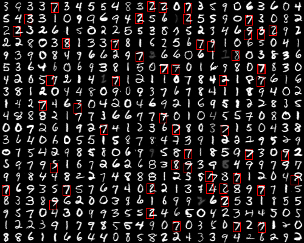
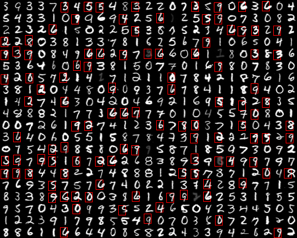

# Image-processing
Processing a BMP image with C. 

Steps of the project:

1 - Encrypt the image

2 - Decrypting the image

3 - Processing the image and try to guess the handwriting numbers using Template matching

---

For the encryption part I used a cypher key.  
With this key I generated pseudo-random numbers with XORSHIFT32 algorithm, and with that number I was able to generate a permutation for the bitmap pixels.  
After the bitmap was permuted I changed the pixels using xor between the pixels (RGB values) and the pseudo-random numbers generated.   
The decryption was possible thanks to the xor properties.  
Example of encryption:

  
  

  

We can see that the Chi-squared test values of the encrypted image are bellow 293.25 so the distribution of the pixels is uniform.

  
  

  

Wikipedia links: 
<a href="https://en.wikipedia.org/wiki/Chi-squared_test">Chi-squared test, </a>
<a href="https://en.wikipedia.org/wiki/Xorshift">Xorshift, </a>
<a href="https://en.wikipedia.org/wiki/Fisher%E2%80%93Yates_shuffle">Fisher–Yates shuffle</a>

---

In the second part of the project I implemented a template-matching algorithm that is guessing handwriting numbers.  
The algorithm determines the Cross-correlation between a template of a number and cut portions from bitmap.
The correlation is valid if it is greater than a certain threshold that is given by the user.    

For 0.5 correlation threshold:

  2:
  
  3:
   
  7:
  
  8:
  

  
